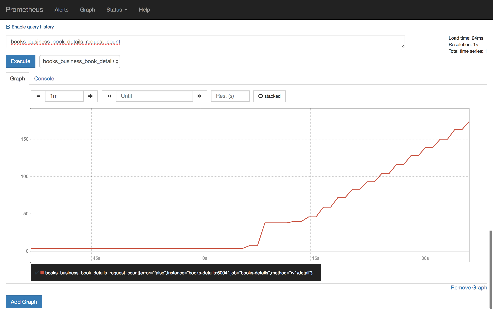
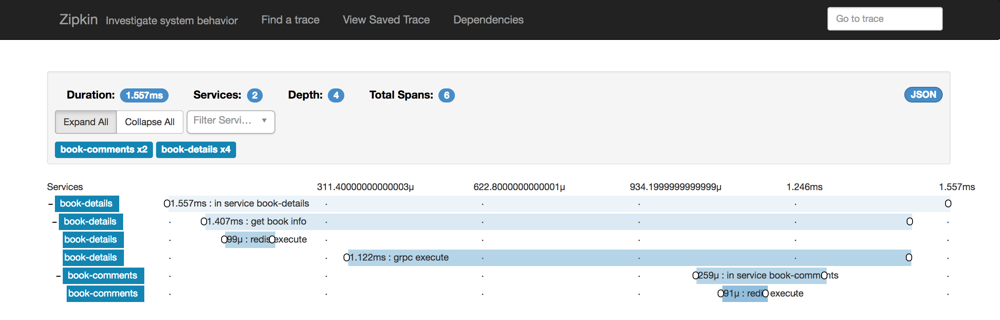
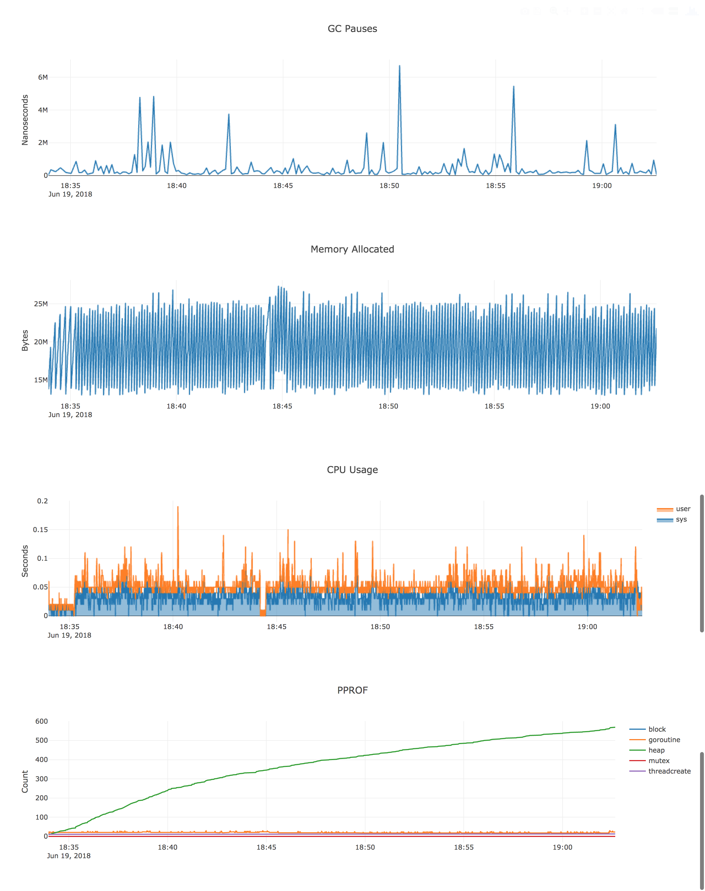
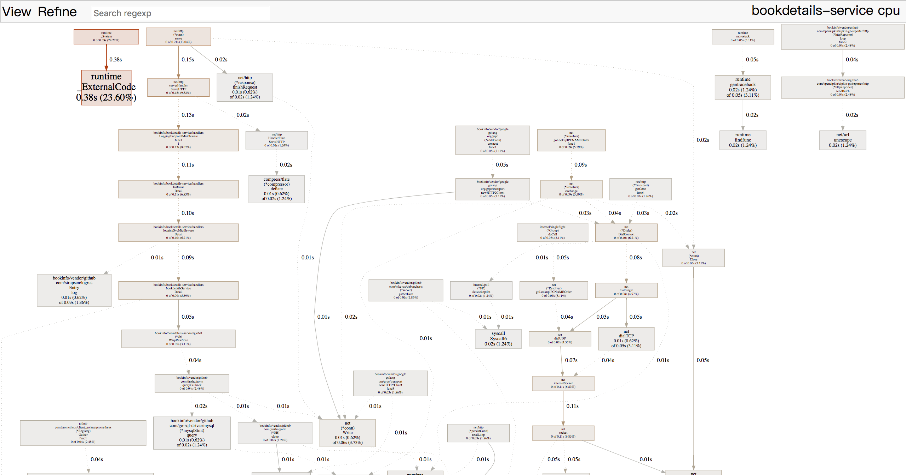
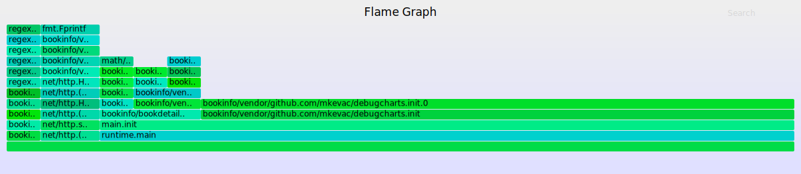
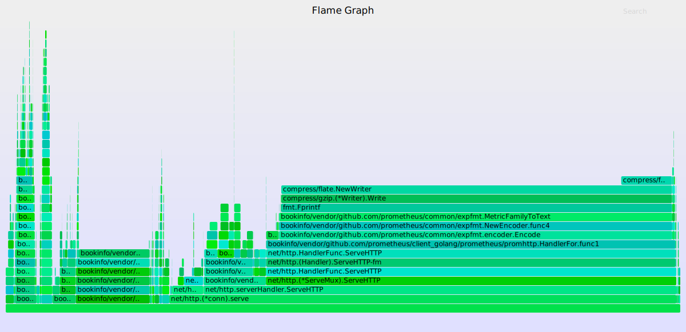

# BookInfo (For Demo)

BookInfo 使用golang编写,实现简单的书籍查询服务。  
项目基于[go-kit](https://github.com/go-kit/kit)搭建,并集成常用组件.  

###### *PS:仅供演示使用.*
---
- [x] 基础代码自动生成
- [x] 依赖库管理
- [x] 实时编译
- [x] 命令行支持
- [x] grpc支持
- [x] grpc => http 协议转换支持
- [x] 服务熔断
- [x] 访问频率限制
- [x] prometheus采集支持
- [x] docker启动
- [x] 自定义中间件
- [x] 实时debug图表信息
- [x] pprof分析器，图表化
- [x] 生成火焰图 
- [x] 服务优雅退出 graceful
- [x] yaml配置文件支持
- [x] env配置文件支持
- [x] zipkin全链路追踪
- [x] test demo
- [x] benchmark demo

## 文件目录结构
```
.
├── docker //docker相关
├── pb //pb文件保存目录
├── vendor //依赖库
├── glide.yaml //依赖库配置文件
├── book-servername //书籍服务
|   ├── bin //go build后bin包
|   ├── cmd //服务启动&访问入口
|   |   ├── servername //客户端
|   |   └── servername-server //服务端
|   ├── conf //多环境配置文件保存目录
|   |   ├── container.yaml //容器模式下配置文件
|   |   └── local.yaml //本地开发模式下配置文件
|   ├── global //全局生效 服务实例&变量&配置
|   |   ├── conf.go //实例化配置文件
|   |   ├── db.go //数据库相关
|   |   ├── errors.go //错误信息配置
|   |   ├── global.go //全局变量&配置 入口
|   |   ├── grpcclient.go //grpc客户端
|   |   ├── logger.go //日志实例
|   |   └── zipkin.go //zipkin相关
|   ├── handlers //业务逻辑目录
|   |   ├── handlers.go //最终服务实现入口文件
|   |   ├── hooks.go //钩子(graceful在此实现)
|   |   ├── middlewares.go //中间件加载文件
|   |   ├── mw_ep_name... //endpoint类型中间件
|   |   └── mw_svc_name... //svc类型中间件
|   ├── models //数据模型
|   |   ├── migrate.go //数据库迁移文件
|   |   ├── modelname.go //模型文件
|   |   └── ... //模型文件
|   ├── runtime //保存程序运行时数据
|   |   ├── pid //服务运行pid
|   |   ├── logs //日志保存目录
|   |   └── ... //其他运行时数据
|   ├── svc
|   |   ├── client //服务访问相关
|   |   |   ├── cli //命令行方式
|   |   |   ├── grpc //grpc方式
|   |   |   └── http //http方式
|   |   ├── server //服务启动相关
|   |   |   └── run.go //服务启动逻辑
|   |   ├── endpoints.go //endpoints实现
|   |   ├── transport_grpc.go //transport grpc实现
|   |   └── transport_http.go //transport http实现
|   ├── .realize.yaml //实时自动编译配置文件
|   └── .env //项目运行环境变量
└── book-servername ... //其他服务,目录结构相同
```

## 生成自动化代码
```bash
# *ps:生成动作会覆盖现有代码
# books-details
$ truss $GOPATH/src/bookinfo/pb/details/details.proto \
  --svcout bookinfo/bookdetails-service
> 代码生成目录 $GOPATH/bookinfo/bookdetails-service

# books-comments
$ truss $GOPATH/src/bookinfo/pb/comments/comments.proto \
  --svcout bookinfo/bookcomments-service
> 代码生成目录 $GOPATH/bookinfo/bookcomments-service
```

## 启动服务
```bash
# docker
$ cd $GOPATH/src/bookinfo
$ docker-compose -f docker/docker-compose.yaml up -d
# *ps:修改本地代码后 容器中服务会自动重新编译启动
```

## 访问服务
```bash
### books-details
# grpc
$ docker-compose -f docker/docker-compose.yaml \
  exec books-details \
  go run /go/src/bookinfo/bookdetails-service/cmd/bookdetails/main.go detail -id 1
# http
$ curl "http://localhost:5001/v1/detail?id=1"

### books-comments
# grpc
$ docker-compose -f docker/docker-compose.yaml \
  exec books-comments \
  go run /go/src/bookinfo/bookcomments-service/cmd/bookcomments/main.go get -id 1
# http
$ curl "http://localhost:5011/v1/get?id=1"
```

## 熔断
```bash
# 满足以下规则进行熔断:
#   异常请求超过10%
#   并发请求超过10
> {"code":429,"msg":"too many connections"}
```

## 限频
```bash
# 满足以下规则进行限频率:
#   每秒 10次请求
# *ps:配置规则为 N秒 M个请求
> {"error":"rate limit exceeded"}
```

## 优雅退出
```bash
# *ps:docker-compose方式启动时会启动自动编译服务,测试优雅退出功能需要在本地运行服务,或者以pid 1进程运行在docker中
# 测试优雅退出可以在代码中增加sleep进行测试
$ cat $GOPATH/src/bookinfo/bookdetails-server/runtime/pid | xargs kill -s SIGINT
```

## prometheus监控 
```bash
$ open http://127.0.0.1:9090
```


## zipkin调用链路跟踪
```bash
$ open http://127.0.0.1:9411
```


## Debug
> 实时图表化数据
```bash
$ open http://localhost:5003/debug/charts/
```


> pprof
```bash
$ cd $GOPATH/src/bookinfo
# 采集数据
$ docker-compose \
  -f docker/docker-compose.yaml \
  exec books-details \
  go tool pprof -web localhost:5003/debug/pprof/profile
  
# 采集结果
> Saved profile in /root/pprof/pprof.bookdetails-service.samples.cpu.002.pb.gz

---------------------------------------------------------------------------------
# 启动http服务 展示采集结果
$ docker-compose -f docker/docker-compose.yaml \
  exec books-details \
  go tool pprof -http=0.0.0.0:5005 \
  /root/pprof/pprof.bookdetails-service.samples.cpu.002.pb.gz
  
# 访问服务
$ open http://localhost:5005
```


> cpu火焰图
```bash
$ cd $GOPATH/src/bookinfo

# 采集数据生成火焰图
$ docker-compose -f docker/docker-compose.yaml \
  exec books-details \
  /go/bin/go-torch \
  -t 30 \
  --file "torch.svg" \
  --url http://localhost:5003

# 获取生成的火焰图
$ containerName=`docker-compose -f docker/docker-compose.yaml ps books-details | grep books-details | awk '{print $1}'`; \
  docker cp $containerName:/go/torch.svg /tmp && \
  open -a /Applications/Google\ Chrome.app /tmp/torch.svg

```


> 内存(inuse_space)火焰图 *PS:用于分析程序常驻内存情况*
```bash
$ cd $GOPATH/src/bookinfo

# 采集数据生成火焰图
$ docker-compose -f docker/docker-compose.yaml \
  exec books-details \
  /go/bin/go-torch \
  -t 30 \
  --file "torch_mem_inuse_space.svg" \
  -inuse_space http://localhost:5003/debug/pprof/heap \
  --colors=mem

# 获取生成的火焰图
$ containerName=`docker-compose -f docker/docker-compose.yaml ps books-details | grep books-details | awk '{print $1}'`; \
  docker cp $containerName:/go/torch_mem_inuse_space.svg /tmp && \
  open -a /Applications/Google\ Chrome.app /tmp/torch_mem_inuse_space.svg

```


> 内存(alloc_space)火焰图 *PS:用于分析程临时分配内存情况*
```bash
$ cd $GOPATH/src/bookinfo

# 采集数据生成火焰图
$ docker-compose -f docker/docker-compose.yaml \
  exec books-details \
  /go/bin/go-torch \
  -t 30 \
  --file "torch_mem_alloc_space.svg" \
  -alloc_space http://localhost:5003/debug/pprof/heap \
  --colors=mem

# 获取生成的火焰图
$ containerName=`docker-compose -f docker/docker-compose.yaml ps books-details | grep books-details | awk '{print $1}'`; \
  docker cp $containerName:/go/torch_mem_alloc_space.svg /tmp && \
  open -a /Applications/Google\ Chrome.app /tmp/torch_mem_alloc_space.svg

```


> 常规debug信息
```bash
$ open http://localhost:5003/debug/pprof/
$ open http://localhost:5003/debug/pprof/cmdline
$ open http://localhost:5003/debug/pprof/profile
$ open http://localhost:5003/debug/pprof/symbol
$ open http://localhost:5003/debug/pprof/trace
```

## Test
```bash
$ docker-compose -f docker/docker-compose.yaml \
  exec books-details \
  go test -v -cover=true ./src/bookinfo/bookdetails-service/...
  
--------------------------------------------------------------------------------------

=== RUN   TestBooksDetailsV1Detail
--- PASS: TestBooksDetailsV1Detail (0.01s)
PASS
coverage: 32.0% of statements
ok  	bookinfo/bookdetails-service/handlers	0.052s	coverage: 32.0% of statements
```

## Benchmark
```bash
$ docker-compose -f docker/docker-compose.yaml \
  exec books-details \
  go test -bench=. -benchtime=30s -benchmem -run=none \
  ./src/bookinfo/bookdetails-service/handlers/handlers_test.go \
  ./src/bookinfo/bookdetails-service/handlers/handlers.go
  
-------------------------------------------------------------------------------------------------------

goos: linux
goarch: amd64
BenchmarkBooksDetailsV1Detail-2   	    5000	   7844925 ns/op	  151718 B/op	     741 allocs/op
PASS
ok  	command-line-arguments	40.047s
```

## 服务单独启动
```bash
# zipkin
$ docker run -d \
  --rm \
  --name zipkin \
  -p 9411:9411 \
  openzipkin/zipkin
  
# mysql
$ docker run -d\
  --name mysql-bookinfo \
  --rm \
  -p 3406:3306 \
  -e MYSQL_ROOT_PASSWORD=root \
  -e MYSQL_DATABASE=bookinfo \
  mysql:5.6 \
  --character-set-server=utf8 \
  --collation-server=utf8_bin
  
# prometheus
$ docker run -d \
  --rm \
  -p 9090:9090 \
  --name prometheus \
  -v $GOPATH/src/bookinfo/docker/prometheus/data:/prometheus-data \
  prom/prometheus \
  --config.file=/prometheus-data/prometheus.yml
```